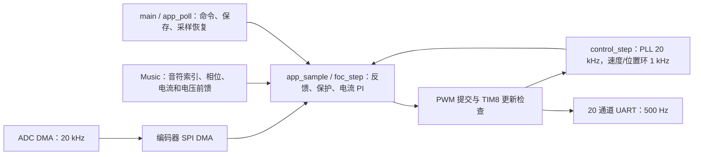

# 2026-10-04 整体代码审查与精简验收

已审查全部手写 App C/H、入口、中断、链接布局和实际构建路径，完成局部精简与故障退出修复。
最终烧录正式 Release，音乐前馈保持开启，不含临时音乐采集缓冲。
**完整运行验收未通过：高速起步再次触发编码器欠压；20 A 音乐在 50 rpm 下明显扰动速度。**
本轮原始数据、源码基线、测试及烧录证据位于 `build/bench_debug/20261004_022108_audit/`。

## 框架与职责

保留现有模块，不增加调度器、状态框架、配置项或诊断缓冲。
硬件异常走 `app_fault` 立即关功率；`foc_trip` 锁存首故障并清目标。
命令按 UART 到达顺序处理，修改控制状态时短暂关中断；音乐结束或 `music stop` 保留运动状态。

## 已修改的实际问题

| 问题 | 最小修改与原因 |
|---|---|
| FOC 与音乐各存 513 点相同正弦表 | 共用一份只读表，保留第 513 点供插值，不新增查表函数 |
| `electrical_deg` 只写不读 | 删除变量及每次采样的弧度转度计算 |
| 3 个 ADC 原始码全局变量只用于再次换算 | 从 DMA 数据直接换算电压，删除 3 个 volatile 全局中间量和反复存取 |
| `control.active` 与模式/状态重复 | 非转矩模式只由有效控制命令进入；停止必回转矩模式。用模式与 FOC 状态判断，删除该布尔量 |
| 音乐 `playing` 与音符终止位置重复 | 音符索引 0～7 表示播放，8 表示停止；删除布尔量，结束后先判停止再访问数组 |
| OFFSET 初始化重复赋值、零偏结束自动校准分支不可达 | 删除；校准只能在零偏已就绪的 IDLE 显式启动 |
| 关功率仍留 `ready` 待提交标志 | 关断同步撤销提交，避免停止后仍被当作有待更新输出 |
| 采样链路停滞只在 FAULT 恢复 | 扩展既有 2 ms 检查：待机/零偏采样停住也进入故障，仅重启采样；初始化及 Flash 暂停后更新计时起点 |
| 低优先级故障处理可能被控制中断打断 | 关功率与故障锁存合并到原有 IRQ 临界区，恢复原 PRIMASK，支持嵌套调用 |
| 自动保存成功可能覆盖期间发生的故障 | 保存后在临界区检查故障，只在无故障时回 IDLE；离线注入保存期间通信故障验证锁存保留 |
| UART RX DMA 错误后接收可能永久停住 | 同一 RX 处理入口触发通信故障、丢弃损坏缓冲并重启接收；电机保持停机，不自动清故障 |
| 重启采样可能用旧编码器读数清错 | 停止 SPI 时标记角度无效，等新帧到来后才满足清错条件 |

相对本轮开始的源码，删除 6 个冗余状态/数据变量；手写 C/H **净增 5 行**，其中新增内容用于上述保护退出。
正式 Release 从 41356 B 降至 **39220 B**，减少 **2136 B**；RAM 从 3648 B 降至 **3632 B**。
Debug 为 48876 B。保留原有参数、20 A dq 目标预算、25 A 原始相电流保护及 PWM 截止计数 600。

## 数学、状态、数组和并发审查

两份测速不是同一个公式：`foc.rpm` 用于电角速度预测/超速保护，PLL 用于外环反馈。
`position_roundoff` 保留长期多圈微小增量；20 kHz 角度增量与 1 kHz 位置更新各有用途。
速度 PI 的 `last_p`、输出状态与限变率反算也各有作用，删除会改变模式切换或抗饱和行为。
原始电流保护不经过音乐比例通道低通；输入无效时不会继续送入 Park/PI。
当前 PWM 窗口的反馈检查和新占空比检查分别检查已执行与待提交的输出，不合并为一次检查。

| 状态 | 正常退出 | 停止/异常退出 |
|---|---|---|
| OFFSET | 连续静止 200 ms，采 2048 点后到 IDLE | 零偏不合格到 FAULT；持续转动时继续等待、功率关闭；采样停滞到 FAULT |
| IDLE | 有效启动命令到 PRECHARGE | 无需自动退出；采样停滞也会报故障 |
| PRECHARGE | 40 个样本后 RUN 或 CALIBRATE | stop 撤销启动；链路/电流/母线/时序异常关功率 |
| CALIBRATE | 120000 个样本后 SAVE | 跟随失败到 FAULT；stop 中断且校准保持无效，须重新校准 |
| SAVE | 前台保存成功到 IDLE | Flash 失败到 FAULT；保存期间新故障保持 FAULT |
| RUN | 持续保持运动目标；音乐单独结束 | stop 到 IDLE；任何保护故障到 FAULT |
| FAULT | 显式 clear 且数据新鲜、安全条件满足后到 IDLE/重新零偏 | 拒绝启动；stop 不清故障；采样恢复不恢复功率 |

TIM8 更新与 ADC 异常中断优先级 0，ADC/SPI DMA 为 1，UART RX/USART 为 2，UART TX DMA 为 5。
故障锁存和功率关断优先于普通命令/音乐。Flash 保存期间停止 ADC/SPI/PWM；故障不会被保存完成覆盖。
HardFault/NMI 等终止处理关功率后等待复位，这是有意的终止路径。

正弦表索引掩码为 0～511，插值末点最多 512；音乐索引停止值 8 不进入音符数组。
齿槽表两端使用 511 掩码；UART 行长度最多 63，预留 NUL；TX 队列满时丢整帧，RX 溢出/坏字节拒绝整行。
Flash 记录固定 56 B、4 B 对齐，双扇区交替、校验和/有效标记验证，保留旧格式读取。
手写 App 没有动态分配/释放，也没有自建函数指针表；数据指针均来自固定缓冲、有效参数成员或限定 Flash 地址。
未发现实际越界、野指针、未初始化使用证据；这不是所有硬件异常下的形式化证明。

## 离线验证

- Debug/Release 构建，`MUSIC_ENABLE=0/1` 四种组合通过；最终恢复为 1。
- GCC `-fanalyzer`、数组边界、转换、格式、原型、遮蔽检查覆盖全部手写 C 及 main/中断文件。
  手写代码没有告警；保留一个 CMSIS 内联函数参数 `control` 遮蔽全局名的供应商头文件告警。
- 直接编译真实 app/control/foc/music，使用台架外设桩验证命令拒绝、启动/停止、清错门槛、首故障优先级、
  校准完整结束/中断、保存失败/期间新故障、待机采样超时，以及 100000 组 SVPWM 占空比窗口。
- 8 音符全过程及结束检查通过：目标频率误差小于 0.001 Hz，20 A D/2 A Q 峰值及 dq 预算通过；
  运动目标保留、音乐结束保持 RUN、26 A 原始相电流触发过流通过。
  RL 模型结果只用于回归检查，不代替实机电流响应或声音验证。

## 实机结果与未通过项

首次整理固件为 `799968c6de518945718b36ff7fb5be85e51443029e9a74aaf96af28f64878d39`，见 `first_flash/`。
在该固件完成下列实测；表中平均/标准差取各阶段最后 2 秒，均为原有 500 Hz 外环速度通道。

| 工况 | 平均 rpm | 标准差 rpm | 结果 |
|---|---:|---:|---|
| +1 / -1 rpm，各 20 s | +0.868 / -1.022 | 0.744 / 0.843 | 未触发故障，低速波动仍明显 |
| +5 / -5 rpm，各 10 s | +5.043 / -4.948 | 1.455 / 1.498 | 未触发故障 |
| +50 / -50 rpm，各 6 s | +49.977 / -50.025 | 3.072 / 3.510 | 未触发故障 |
| 0 rpm，3 s | -0.009 | 0.258 | 保持 RUN，stop 后关功率 |
| +50 rpm，完整 D 轴音阶 | +50.944 | 37.932 | 无保护故障；峰值 202.760 rpm，运动精度不能判通过 |
| +1000 rpm 起步 | 未进入稳态 | — | 实际约 193 rpm、Iq 目标 2.28 A 时编码器故障 1，立即停机 |

命令格式错误、超范围、未知参数及 100 字符过长行均按预期拒绝；后续有效命令仍可处理。
首次整理版最低 PWM 提交计数 **801**，高于 600；最大工作周期 **4957 CPU cycles**。
PWM/ADC/编码器时序故障计数为 0，UART 未增加丢帧。
高速首异常原始四字节 `31 6f 14 d0`，CRC 正确、状态 4；手册定义为
[MT6835 欠压告警](https://www.magntek.com.cn/upload/pdf/202407/MT6835_Rev.1.3.pdf)（第 25/32 页）。
这证明传感器上报该告警，尚未测到引脚供电瞬态，不能断言具体接线或供电器件已损坏。

高速失败后没有 clear 重试。计划中的 ±3000/±5000、高速音乐、独立 Q 试听及位置运行未执行。
最后继续离线删除重复布尔状态并修复保存故障仲裁，重新烧录；**最终固件仅验过启动零偏/停机与离线回归，未再次带电运行**。
最终烧录复位会清掉 MCU 故障锁存，但不等于欠压问题已解决。
最终版没有再启动 PWM，待机采样期间仍触发编码器故障 1：首异常 `63 86 7c c3`，CRC 正确、状态 4。
最终快照 `motor_write_min=4200`、`motor_mode=0`，PWM/ADC/编码器时序故障计数仍为 0。
因此当前板上保持 FAULT/功率关闭；告警也出现在不播放、不转动的阶段。

## 建议与交付

1. 先解决编码器上报欠压：在编码器 VDD/VSS 引脚处确认起步期间电压与接地。
   告警未解决前，不扩大速度或清错重试；随后按现有工况逐级补齐运行验收。
2. 音乐暂保持现状。已有 50 rpm 对照证实速度扰动，不把“目标音高固定”称为“运动性能不受影响”。
   后续若要求运动精度，需要先规定允许的速度/位置误差，再决定音乐电流与可用工况。
3. 保留必要保护、PI/PLL 状态和 Flash 兼容读取；减少诊断变量不应删除这些控制状态。
4. 当前方案没有独立硬件看门狗；TIM8 截止保护依赖 CPU 中断正常执行。若需要覆盖 CPU 整体失活，
   还需单独确定硬件停机/看门狗要求。本轮未新增此功能。
5. command_count 等计数用 float32 回传，超过 2^24 会丢失单位精度；长期连续命令场景的主机确认应处理这一边界。
   当前控制状态不依赖这些计数，本轮没有改变波形协议。

最终板上：正式 Release 39220 B，SHA256
`fc0af61247dfba71fefc93cd868e09e426908d85e29fae09afbd4ce125cbf4b2`。
ST-Link `8600A1002031363534313541`；UART 实测 COM14 / 1 Mbaud、84 B/帧、500 Hz，带宽占用 42%。
Flash 参数/校准区前后逐字节一致，SHA256
`219087f5b53129a220740d4e3a06ecd290171babeae387e165fd3ec16ed8468f`；有效记录 generation=8，方向 +1。
实际 current_kp/ki=0.18849556/452.38934，speed_kp/ki=0.008/0.10，position_kp=4，current_ramp=10 A/s，position_speed=100 rpm。
停止证据见 `after.json`、`final.json`：功率关断、目标清零；母线约 24 V 仍供电。
本轮没有识别到可控学生电源串口，没有操作 COM21；端口均已释放，未留下后台测试。
PWM 运行按遥测样本估算累计 **80.686 s**；检查约从 02:21 开始，总时长见归档 `delivery.json`。
