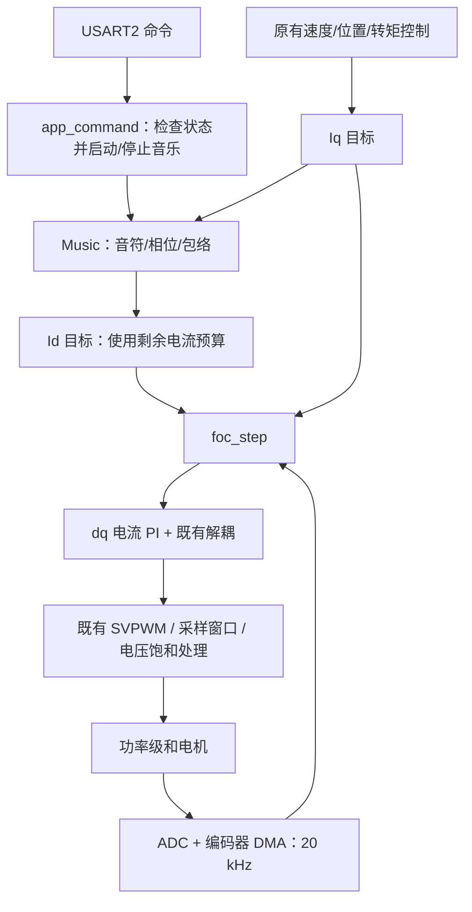

# D 轴电流音乐：第一版 C 大调

当前交付是可以编译的八音符播放实现：C4、D4、E4、F4、G4、A4、B4、C5。
已完成软件波形验证和 MUSIC_ENABLE=0/1 两种配置的 Debug/Release 构建。
尚未烧录、通电播放或测量声音，不能把软件通过解释为这颗电机已经发声。

## 1. 可行性与目标边界

你的路线可用于尝试播放音阶和短音频：电脑处理音源，数据随固件存入内部 Flash，
串口只发播放命令，电流中断每 50 μs 生成一个 Id 目标，Q 轴继续控制运动。

“音符频率不随转速改变”可以在目标生成层实现；“任何转速都能清晰播放”不能保证。
转速越高，反电势占用的电压越多，电流跟随余量越小；运动噪声、负载和机械模态也改变可听效果。
当前系统还有 8600 rpm 超速保护，本版不改变这个范围。

| 目标 | 当前结论 |
|---|---|
| 顺序生成哆来咪发唆拉西多的 Id 目标 | 已实现并离线验证 |
| 电机静止时发声 | 原理可行，需本机电流和声音测量 |
| 边转边生成固定音高的 Id 目标 | 架构支持，需分转速验收实际电流和声音 |
| 所有转速、所有负载下保持音量和音质 | 无法保证，尤其电流或电压饱和时 |
| 本地 MP3 解码后烧入 Flash | 后续短 PCM 片段方案可行，本版未实现 |
| 内部 Flash 存整首普通长度的未压缩音乐 | 容量不足，需缩短片段或另选存储/编码 |
| 电机达到普通扬声器的还原度 | 不能预先保证，需测电磁和机械声学响应 |

已有 2012 年音阶论文，作者实验室列出的题目是
*Generation of music scale from brushless DC motor with surface permanent magnets*。
本次未获得全文，不能拿它的题目或摘要推断本机音量、频响或转速范围。
主动发声专利给出了 dq 电流指令与声辐射结构方案；2025 年的谐波注入研究也讨论了
电磁力、结构振动和声辐射的联动。这些支持试验方向，不能代替本机实测。

来源：[作者论文列表](https://sites.google.com/gunma-u.ac.jp/nkurita/achievements/peer-reviewed-papers)、
[主动发声专利 US11362609B2](https://patents.google.com/patent/US11362609B2/en)、
[谐波电流注入研究](https://re.public.polimi.it/bitstream/11311/1289291/1/Numerical_Modeling_of_PMSM_Noise_Reduction_by_Harmonic_Current_Injection.pdf)。

## 2. 七个音如何实现

“哆来咪发唆拉西多”有七种音级，最后一个哆是高八度，所以顺序播放八个音符。
本版选常用十二平均律、A4=440 Hz，C4 作为起点。

| 顺序 | 唱名 | 音名 | 目标频率 Hz |
|---|---|---|---:|
| 1 | 哆 | C4 | 261.625565 |
| 2 | 来 | D4 | 293.664768 |
| 3 | 咪 | E4 | 329.627557 |
| 4 | 发 | F4 | 349.228231 |
| 5 | 唆 | G4 | 391.995436 |
| 6 | 拉 | A4 | 440.000000 |
| 7 | 西 | B4 | 493.883301 |
| 8 | 高音哆 | C5 | 523.251131 |

每次 20 kHz 更新：

```text
phase[k+1] = phase[k] + f_note / 20000       （一圈为 1）
Id_target[k] = amplitude[k] × envelope[k] × sin(2π × phase[k])
Iq_target[k] = 原有运动电流目标
```

实际代码用 0～512 的查表相位，线性插值现有 FOC 正弦表的数值，
避免在电流中断调用 sinf。Music 自有常量表副本占 2052 字节 Flash。
每音 10000 次发声更新（500 ms），前后各 400 次线性渐变（20 ms），
再输出 2000 次零值（100 ms）。八音总计 96000 次、4.8 秒，包含末尾静音。
每个音从零相位开始，静音段后换音。完成后不循环播放。

峰值为 20 A，稳态正弦 RMS 约 14.14 A。静止、Iq=0 且电流跟随良好时，
对应最大相电流峰值约 20 A；这里是目标电流，不是保证的实测电流。
渐变包络只作用于音乐，不能把 Id 音频套进 1 kHz 外环或 Iq 命令限变率。

按永磁同步电机模型：

```text
T = 1.5 × 极对数 × [磁链 × Iq + (Ld − Lq) × Id × Iq]
```

当 Ld≈Lq 时，D 轴电流对理想转矩的影响较小，仍会改变电磁力。
磁压力与磁场平方有关，叠加永磁体磁场后可出现基频、二倍频和其他分量。
真实磁饱和、角度误差、轴间耦合和结构模态会影响声音，也可能产生运动扰动。
因此不能把纯正弦 Id 目标等同于纯正弦声音，更不能承诺转子完全不动。

## 3. 本版文件和完整调用关系

```text
App/
├─ Music/
│  ├─ music.h       编译开关和四个接口
│  ├─ music.c       八个音频率、相位、时长、包络、剩余电流预算
│  └─ README.md     本文
├─ Control/app.c   串口命令，在现有 IRQ 临界区内操作播放状态
└─ FOC/
   ├─ foc.h        新增 foc.id_ref，便于观察目标
   └─ foc.c        20 kHz 取样并计算 ed = foc.id_ref − foc.id
```



| 接口 | 用途 |
|---|---|
| music_play() | 从第一个音重新开始 |
| music_stop() | 立即清除播放状态 |
| music_active() | 是否仍处于八音播放期间，包括音间静音 |
| music_step(iq_ref) | 每个 RUN 周期取一次，返回当前 Id 目标，单位 A |

主循环命令已经使用 bsp_motor_lock/unlock；FOC 中断拥有音符进度。
本版没有动态内存、解码线程、数据传输协议或另一个定时器。
CMake 只在工程顶层加入源码、包含目录和 -O3；不改 CubeMX 生成文件。

## 4. 开关和命令

在 music.h 中：

```c
#define MUSIC_ENABLE 1
```

设为 0 后重新编译和下载：music_step 恒返回 0，正常 RUN 的 foc.id_ref 恒为 0；
音乐数据和函数被排除，music play 被拒绝。设为 1 也不会开机自动播放。
校准仍使用原有开环 D 轴对齐电压，不能把“Id 目标为零”解释为禁止校准输出。

USART2 配置仍是 1000000 baud、8N1，每条命令以 CR 或 LF 结束。

| 命令/事件 | 结果 |
|---|---|
| music play，当前 IDLE | 零偏和电角度校准有效时，以 Iq=0 进入原有预充并播放 |
| music play，当前 RUN | 重新播放，不改速度/位置/转矩模式及目标 |
| music play，故障/校准/预充/零偏采集中 | 拒绝，沿用结果码 3 |
| music stop | 立即停止音乐、Id 目标清零；保留运动及功率状态 |
| 八音播放结束 | Id 目标归零；FOC 继续 RUN，运动目标继续保持 |
| stop | 关闭功率、清除 Id/Iq 和运动目标，同时终止音乐 |
| 故障 | 原有保护关闭功率并终止音乐 |
| 重新初始化/开始校准 | 清除播放状态，不自动恢复音乐 |

最简单的静止尝试：已有有效校准、无故障且零偏就绪时，发 `music play`。
它是 Iq=0 电流模式，不是位置锁定；电机受到外力或非理想耦合时仍可能动。
结束后发 `stop` 关闭功率。若需要闭环零速保持，先发 `rpm 0`，
确认已经 RUN 后再发 `music play`。

旋转尝试：先用已经验收的转速运行并确认 RUN，再发 `music play`；
`music stop` 只关音乐，`stop` 关整个驱动。再次 `music play` 会立即从头开始，
本版手动停止和重新播放不做额外交叉渐变，可能听到轻微瞬态。

板子仍只输出原有 JustFloat，没有新增文本应答和遥测通道。
通道 16 是命令计数，17 是最近命令结果；1 成功、3 状态不允许。
新增 foc.id_ref 可在停电后的 Debug 中查看，不能用运行断点验收电流波形。

## 5. 电流、电压和音质限制

音乐幅值每周期使用实际采用的 Iq 目标计算：

```text
remaining = max(0, 20² − Iq_target²)
amplitude = min(20.0, sqrt(remaining))
```

这样不会为音乐降低运动 Iq 指令，且目标满足 Id_target²+Iq_target²≤20²。
Iq 到 ±20 A 时音乐目标为零，播放进度仍继续。这是目标预算，
不代替实际电流保护；任一相采样电流绝对值达到 25 A 时跳闸。
20 A 限幅和 25 A 保护按用户请求修改，尚未验证该电流下的硬件能力和波形。

本版没有新增电压余量调度。原有 foc_modulate 在电压不足时统一缩放 dq 电压，
原有 PI 抗饱和仍工作；因此高速时音乐可能衰减/失真，并可能影响运动控制。
不能把电流预算称为“已经保证音频电压优先让位给运动”。
在要求更高的后续版本，应根据实际电压余量逐渐降低音频幅值，再验证运动指标。

源码默认电流 PI 约 600 Hz；若按理想一阶模型估计，C4～C5 实际电流幅值
约为目标的 92%～75%。这是工程估算，Flash 参数可以覆盖默认增益，
数字延迟、死区和实际电机参数也会改变结果。
第一版不修改 PI，也不加入音频 R/L 前馈；先测清当前八个频率的真实 Id。
需要扩展频段时，再评估 R×Id_target + Ld×d(Id_target)/dt 前馈与延迟补偿，
固定正弦可用解析导数，PCM 应先带限，不能直接放大数值微分噪声。

安装方式、转子外壳、定子刚度和阻尼决定声音辐射，某个音响亮不代表其他音同样响亮。
不要在很安静的共振/反共振频点盲目增加电流；也不预先选大惯量或小惯量电机。
本版音乐目标峰值为 20 A，音量仍需结合实际 Id 跟随和机械响应判断。

## 6. 你接受的 MP3 → Flash 后续框架

本节是后续设计，尚未加入固件；第一步仅实现上述音阶。

```text
电脑 MP3 文件
  → 解码完整音频，不只提取主旋律
  → 混成单声道、去直流、按实测电机频响带限、抗混叠重采样
  → 限幅/归一化，导出有符号 PCM 常量数组和样本总数
  → 将 const 数据编译到固件的 .rodata
  → ST-Link 下载固件程序区，保留参数/校准扇区
  → 串口开始命令
  → 20 kHz 中断从 Flash 顺序读取，PCM 换算为安培、叠加包络与电流预算
  → foc.id_ref → 既有电流 PI → SVPWM → 电机
```

第一份短 PCM 可以统一输出 20 kHz，从而一周期取一个样本，避免板端重采样。
8 位每秒 20000 B、16 位每秒 40000 B；位深高不代表电机音质一定更好。
离线工具可用 FFmpeg 做解码、声道混合、滤波和重采样，
后续转换脚本只需把样本写为 C 数组；规范见 [FFmpeg 官方文档](https://ffmpeg.org/ffmpeg.html)。
20 kHz 的数学奈奎斯特边界是 10 kHz，不等于电机或电流环能播放到 10 kHz。
音频带限应以扫频实测为依据，不能把原 MP3 全带宽直接当有效 Id 目标。

F405RG 有 1 MiB Flash，当前链接脚本程序区为 768 KiB，
0x080C0000～0x080FFFFF 的两块 128 KiB 扇区用于参数/校准，必须保留。
[ST 官方芯片资料](https://www.st.com/en/microcontrollers-microprocessors/stm32f405rg.html)
确认了芯片容量；工程分区以 STM32F405XX_FLASH.ld 为准。

本版 Release 程序使用 40708 B，768 KiB 程序区剩余约 745724 B。
据此估算，不计后续播放器代码、对齐等开销：

| 单声道 PCM 格式 | 每秒占用 | 本版余量的理论上限 |
|---|---:|---:|
| 20 kHz / 8 bit | 20000 B | 约 37.3 秒 |
| 20 kHz / 16 bit | 40000 B | 约 18.6 秒 |

这适合短片段；三分钟 20 kHz/16 bit 为 7.2 MB，无法放进当前内部 Flash。
更长音乐才需要另行选择压缩解码或外部存储，不在第一版引入。
Flash 的音乐数组是只读程序数据；运行期间不擦写 Flash，串口不传 MP3 或 PCM。
这样无需二进制分包、流控、欠载缓冲，也不占用编码器 SPI。

## 7. 验证结果和实机验收

离线检查直接编译实际 music.c 为本机库，按 20 kHz 调用后测量零交叉周期，
不是另写一份音阶算法代替它。结果保存在工程 build/music_validation/result.json。

- 八个频率误差均小于 0.001 Hz（相对于理想 20 kHz 软件时钟）。
- 顺序、每音 500 ms 加 100 ms 静音、总计 4.8 秒正确。
- 峰值不超过 20 A，起止 20 ms 渐变、停止和重新播放检查通过。
- Iq=0、±12、±19.999、±20 A 时目标电流预算检查通过；±20 A 时音频为零。
- MUSIC_ENABLE=0 时取样输出为零、无活动播放状态，ELF 排除了音乐函数。
- MUSIC_ENABLE=0/1 的 Debug 和 Release 均构建通过；最终源码开关恢复为 1。
- 最终 Release Flash 40708 B，RAM 3640 B；没有触碰芯片或校准 Flash。

上述误差不包含真实采样时钟误差，也不代表实际 Id 或声音的频率测量结果。
查表和目标处理的实际最坏执行时间仍需在 F405 上测量；保持现有截止检查，
不要通过放宽时序保护来让音乐运行。

实机第一步应分三层验收：

1. 电流：静止时逐音验证实际 Id 的频率、幅值、Iq 扰动及相电流峰值，
   并检查 motor_work_max、PWM 截止和采样窗口。500 Hz 回传的奈奎斯特边界
   只有 250 Hz，八个音全部超过它，会发生混叠；需要短时 20 kHz 原始采集
   或示波器，不能用现有慢速波形 FFT 判定音准。
2. 声音：用麦克风录音，检查八个音是否可辨、基频与谐波、相对音量，
   固定安装和录音距离；电流通过而声音很小应先检查机械响应。
3. 运动：基础音阶通过后，在已验收的低速起逐级测正反转、不同母线/负载；
   比较开关音乐前后的转速/位置误差、电流、饱和和温升，确定可用工况。

当前 [MT6835 诊断记录](../../docs/mt6835/20261003-undervoltage-followup.md)
仍未确认间歇欠压根因，且未完成带电旋转验收；编码器无效时本版继续拒绝启动/触发原有保护。
音乐功能不改变该诊断结论，旋转验收需先具备可靠的运动控制基础。

在工程根目录构建和下载：

```powershell
cmake --preset Release
cmake --build --preset Release
python ../download/flash.py flash Release --erase=program
```

选择仅擦程序区。下载会复位 MCU，开始播放前需等零偏完成并确认校准有效、无故障。
本次未执行下载命令；本地构建产物位于 build/Release/405_FOC.bin、.hex、.elf。
