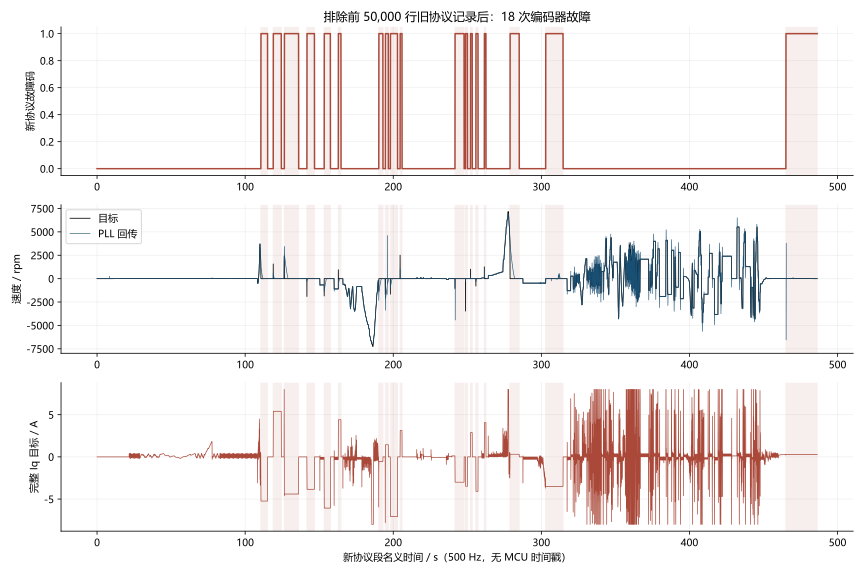
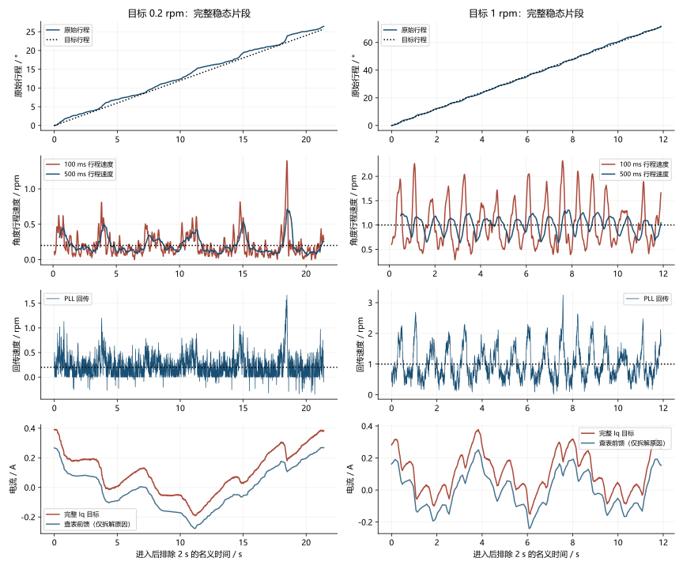
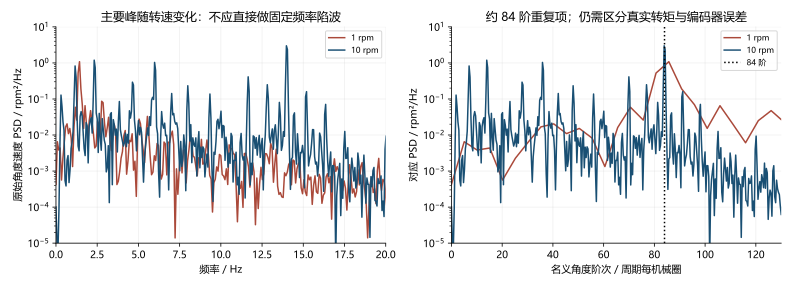
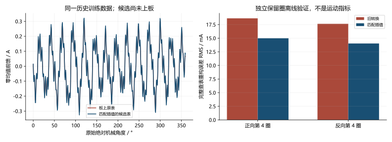

# fb60f4e 日志：反复故障与低速顿挫分析

2026-10-03。本页依据原始 CSV、当前源码、板上 Flash 回读、停机 SRAM 诊断和真实 C 模块复现。图由 NumPy / SciPy / Matplotlib 渲染，提供 SVG、PNG 和 PDF；没有把观测器输出当作独立机械测量。

**本轮结论：前 50,000 行是一段旧协议的零偏故障记录；后段有 18 次独立编码器故障。0.2 rpm 确实在转，但原始角度进度仍不均匀。已烧录编码器异常增量隔离修复；抗齿槽候选表仅完成离线验证，低速丝滑验收尚未通过。**

## 1. 先把两段协议分开

原文件 `D:\Downloads\fb60f4e电机日志.csv` 共 293,122 个数据行，保持只读。SHA256：`91df5949a0540e6cd4aa249043e34046ed1b963d95507b46294096f4b9f95da8`。以下行号从零开始，不含表头。

| 范围 | 实际内容 | 能确定的事实 |
|---|---|---|
| 0～49,999 | 历史 24 通道的前 20 列 | I5 是母线电压；I11=5 为故障状态；I12=9 为零偏故障；I13=5 为命令计数；I17/18 为电流 PI 参数 |
| 50,000～293,121 | 当前固定 20 通道 | I3 为母线，I15 为状态字，I16 为命令计数，I11～14 为零偏均值/噪声 |

旧段始终是同一个锁存的零偏故障，命令计数和结果没有变化，不能算作 50,000 次重新故障。历史源码 `ad7a2e9` 对应的原始噪声上限为 2 mV；当前上限经用户要求改为 4 mV。**旧段没有零偏均值、标准差和四项失败原因，不能由它判断究竟哪一路均值或噪声失败，也不能把后段的 3.15/3.37 mV 填回旧段。**

为何导出文件拼接了不同协议尚未确认。VOFA 旧波形保留是一种待核实的解释，文件名和 20 列表头均不能证明全部记录来自 fb60f4e。如果把前段 I15 当作当前状态字，会误读出故障码 0。

CSV 没有 MCU 时间戳、帧序号或人工加载标记。图中的时间按 500 Hz 换算，为名义时间；不能据此精确定位手动施加载荷，更不能用于原生 20 kHz 电流环的频响辨识。

## 2. 后段的 18 次故障是什么

排除旧段后，共 243,122 帧，名义长度 486.244 s。故障码全部为 **1：编码器**。没有零偏、ADC 或控制时序故障；ADC 有效标志持续为 1，UART 发送丢帧计数为 0，时序来源及计数为 0。

| 项目 | 后段记录 |
|---|---:|
| B / C 零偏均值 | 1.660698 / 1.680863 V |
| B / C 原始采样标准差 | 3.153083 / 3.365612 mV |
| 零偏统计完成 / 失败原因 | 全段完成 / 全段 0 |
| 原始编码器角度为 NaN | 668 帧 |
| 首帧角度为 NaN 的故障事件 | 7 / 18 |

这两路零偏在当前 1.4～1.9 V、4 mV 判据内。新段反复故障不能归因于零偏噪声。角度 NaN 说明读取未被接受，但 CSV 没有首个 SPI 原始帧或 CRC 字段，不能仅凭 NaN 区分 CRC、芯片状态告警和其他读取异常。



图中故障时通道 0～2 是首次故障电流现场，随后持续显示的 Iq 目标不代表功率还在输出。故障后的目标转速自动归零，功率位为 0。图保留完整数据用于展示锁存行为；稳态统计排除故障段。

| 事件 | 首帧数据行 | 故障前目标 rpm | 故障前 Iq 目标 A |
|---:|---:|---:|---:|
| 1 | 105304 | 830 | −5.115 |
| 2 | 109480 | 1570 | 5.280 |
| 3 | 113233 | 2380 | −4.523 |
| 4 | 120849 | −1910 | −3.720 |
| 5 | 126683 | −1850 | −6.067 |
| 6 | 131454 | 950 | 4.402 |
| 7 | 145115 | −1350 | −0.666 |
| 8 | 147341 | −1720 | 1.320 |
| 9 | 149025 | −1660 | −6.840 |
| 10 | 152310 | 2510 | 2.880 |
| 11 | 170837 | −1040 | −2.880 |
| 12 | 174391 | −3470 | −3.360 |
| 13 | 176063 | 1010 | 2.640 |
| 14 | 177894 | −790 | −3.840 |
| 15 | 180744 | 1260 | 3.938 |
| 16 | 189424 | 3810 | 0.147 |
| 17 | 201454 | −480 | −3.613 |
| 18 | 282554 | 0 | 0.266 |

最后一次在零速保持时触发，电流目标只有约 0.266 A，不能把所有故障简单归为高速反转冲击。完整事件和首帧字段见 [解码结果](user_log_analysis.json)。

### 板上首个异常给出了进一步证据

接管串口后先发送并确认 `stop`，再用 ST-Link 停机读取诊断。板上 Debug 镜像与本地 fb60f4e 构建逐字节相符；Flash 加载的速度参数为 **Kp=0.01 A/rpm、Ki=0.2 A/(rpm·s)**，不是先前 0.1/2 的高增益版本。

首个异常 SPI 帧为 `1E 8C DC DE`：状态为 4，CRC 计算值与接收值都为 `DE`。按 [MT6835 Rev1.3 数据手册](https://www.magntek.com.cn/upload/pdf/202407/MT6835_Rev.1.3.pdf) 的 SPI 帧与状态定义，这是 **CRC 正确的编码器欠压告警**。故障累计 26,499，停机观察 2 s 未增加；ADC、编码器时序及 UART 错误计数均为 0。证据见 [板上诊断](board_diagnostics.json)。

它证明本次上电至少发生过真实芯片欠压状态报告，不能证明 18 次全部是同一个电气原因。没有芯片 VDD 波形，仍不能确定是供电跌落、接地或连接问题。约 23.2 V 母线、ST-Link 约 3.1 V MCU 供电读数，都不能代替编码器芯片处的 VDD。软件 PLL 或抗齿槽算法无法修复这个告警。

停机只读检查的寄存器为 HYST=7（默认 0.011°）、BW=5（默认基准带宽×32）、NLC=0。未修改寄存器或 EEPROM。[寄存器读数](encoder_settings.json)。这些设置可能影响小角度测量，现有数据不能把全部顿挫归因于滞回，也没有据此直接提高带宽或关闭滞回。

## 3. 低速“能转”与“丝滑”分别看什么

所有稳态段统一排除目标进入后的前 2 s，保留该段剩余全部样本。原始角度先跨 360° 展开；净行程给出平均速度。短时速度使用相同的 25 点、三阶 Savitzky–Golay 导数，即约 50 ms 窗口。另用原始角度的 100/500 ms 净进度验证较慢的走走停停。

这些是编码器原始角度的独立计算，与固件 PLL 输出分开；它们仍包含编码器非线性和测量误差，不等同外部高精度机械测速。没有对完整 Iq 目标滤波，也没有减掉前馈后作为验收成绩。

| 目标 rpm | 稳态时长 s | 原始净行程均速 rpm | 原始角度 50 ms 速度 σ rpm | PLL 速度 σ rpm | 完整 Iq 目标 σ A |
|---:|---:|---:|---:|---:|---:|
| +0.2 | 21.402 | 0.20588 | 0.20205 | 0.21479 | 0.14600 |
| +1 | 11.902 | 1.00340 | 0.50356 | 0.51071 | 0.12498 |
| +10 | 23.402 | 9.99152 | 1.02511 | 1.04733 | 0.14898 |
| +2080 | 3.652 | 2080.00840 | 1.25358 | 7.37867 | 0.07190 |
| +2400 | 4.302 | 2400.00421 | 1.42486 | 7.40290 | 0.06315 |

用户观察的平均跟随是有依据的：0.2 rpm 的 21.4 s 段真实角度前进 **26.44°**。但 500 ms 进度速度的标准差仍是 **0.120 rpm**，1% / 50% / 99% 分位约 **0.076 / 0.157 / 0.668 rpm**，相对 0.2 rpm 目标变化很大。100 ms 的对应分位约 0.022 / 0.159 / 0.805 rpm。

因此问题不只是 PLL 曲线看起来不平；较长时间的实际角度进度也不均匀。与此同时，这段只覆盖约 26°，+1 rpm 段只覆盖约 72°，不能从局部角度宣称整圈的抗齿槽补偿好坏。窗口统计另存于 [原始角度进度数据](raw_progress.json)。



图中前馈曲线仅用于定位来源：0.2 rpm 段完整 Iq 目标 σ≈0.146 A，旧表查值 σ≈0.142 A，扣除查值后的 PI 余量 σ≈0.013 A。**约 0.013 A 不是验收结果**；最终电流目标必须计入前馈。方差存在相关项，不能把标准差之比解释成精确的因果占比。

高速段平均速度跟随良好，但完整 Iq 目标标准差 0.063～0.072 A 仍高于 0.02 A，且各段不足 10 s、未重复三次。50 ms 导数会压低高速噪声和较高频运动，不能据其小标准差宣称高速更平稳。本轮没有新的原生 20 kHz 采样或闭环 Bode 数据。

## 4. 论文与工程代码如何指导下一步

### 先区分角度周期项与固定频率共振

+1 rpm 片段主要速度峰约 1.43 Hz，+10 rpm 约 13.98 Hz，换算均接近 **84 次/机械圈**。频率随速度变化，适合继续做角度阶次对照，不能直接当成一个固定 14 Hz 共振。



右图横轴由时域频谱除以目标机械频率换算，未做角度重采样，纵轴仍保留原频率谱密度单位。它提供名义阶次线索，不能单独证明跨圈可重复。这里可能含真实角度相关转矩扰动，也可能含编码器周期误差，不能仅凭该图认定全是齿槽转矩。[Ramos Garces 等的 PMSM 频响整定研究](https://arxiv.org/html/2202.08648v1) 使用辨识后的对象与相干性设计 PI/陷波；本机仍缺足够原生数据，现阶段没有新增陷波。

### 抗齿槽标定要匹配真实回放，而非只比较表格点

[Piccoli、Yim 的研究](https://journals.sagepub.com/doi/10.1177/0278364915599045) 支持以位置表征重复的齿槽转矩。[ODrive controller.cpp](https://github.com/odriverobotics/ODrive/blob/3a2e4dd1bfbda9e4c534d5c7d8428a99c361e783/Firmware/MotorControl/controller.cpp) 采用逐位置保持，等待位置误差与速度都足够小，再记录积分转矩。[ODrive 官方指南](https://docs.odriverobotics.com/v/latest/guides/anticogging.html) 也要求稳定反馈和可靠角度对应，并指出补偿误差与延迟会影响稳定裕量。

当前表来自历史 ±1 rpm 运动标定：各方向前三圈训练、第四圈独立验证，保留跨圈重复成分并去除 DC。这个方法可能混入运动加速度或测量周期误差；本轮没有把它改写成已实现的 ODrive 静态标定。供电条件明确后，应对同一角度做补偿开/关及逐位置保持对照，确认必要转矩与实际运动同时改善。

发现并修复了一个确定的主机计算缺陷：旧工具先平均角度区间，再用相邻表值平均移半格，削弱了周期成分；固件实际却按两个相邻节点线性插值。现在直接以固件真实的权重 `1−f、f` 最小二乘求 512 个节点，原有跨圈选择和独立保留圈保持不变。实时查表、Flash 格式和 MCU RAM 都没有增加。

| 独立验证 | 旧转换的实际线性查表重构 RMS | 匹配插值候选 RMS | 降幅 |
|---|---:|---:|---:|
| 正向第 4 圈 | 18.647 mA | 14.990 mA | 19.61% |
| 反向第 4 圈 | 17.635 mA | 14.028 mA | 20.46% |

比较的是同一原始样本上完整插值输出的重构误差，不是表节点误差，也不是闭环电流标准差。候选峰值由 0.307 增至 0.326 A；它并不保证电流更小。**候选尚未用于本轮带电运行，不能据上述降幅宣称顿挫改善。**



历史源日志 SHA256：`411d84b6b1a4ec20327ab52be885d8135c301d0bc4011a686640d12ad690dfed`。参见 [候选来源](matched_table_provenance.json)、[按实际查表验证](lookup_fit_validation.json)、[候选 512 点表](matched_cogging_table.inc)。训练、验证原始 CSV 未修改，原表仍保留在正式固件。

### 测速与低速反馈保持可验证

[ODrive encoder.cpp](https://github.com/odriverobotics/ODrive/blob/3a2e4dd1bfbda9e4c534d5c7d8428a99c361e783/Firmware/MotorControl/encoder.cpp) 的两状态编码器 PLL 提供位置残差校正结构；当前测速只由编码器驱动，不再把电流或目标作为速度预测来源。[moteus 控制结构](https://mjbots.github.io/moteus/guides/control-modes/) 提供结合位置/速度误差处理低速的工程参考，但增加位置积分会改变带宽与抗饱和，当前没有无证据地叠加另一个积分器。

本轮保持 PLL 带宽、速度 PI、参考权重、120 A/s 限变率和原来的角度谐波修正。下一轮先比较原表/候选表/关闭前馈的原始角度进度，再决定反馈是否需要修改。只调低反馈噪声或只让回传曲线变平，均不足以验收。

## 5. 本轮具体代码修改与验证

### 异常角度原本仍可进入 PLL

旧流程在检查角度跳变之前先写入 `foc.angle_step`。FOC 检查拒绝跳变并关功率，但后续 `control_step()` 仍能使用这个增量更新 PLL。真实 C 模块注入受保护拒绝的 20° 跳变后，速度由约 **0.998 → 662.832 rpm**，累计位置没有变化。这是故障瞬间反馈污染，与芯片欠压根因分开。

```text
此前：角度增量 → 写 angle_step → 跳变保护拒绝、停机
                                  └→ 外环仍用异常增量更新 PLL

现在：原始角度 → 有限性 / 增量保护 → 有效增量 → PLL → 速度 PI
                           └→ 无效标记、停机、跳过 PLL/位置更新
原始绝对角度 → 原表线性查值 → 与 PI 相加 → ±8 A → 120 A/s → 电流环
                                                └→ 统一反算抗饱和
```

`foc.c` 在无效或被拒绝的增量上写 NaN，`control.c` 跳过该样本，状态位 11 同时表示当前原始读数和增量都已通过检查。没有增加嵌入式状态变量或协议字段。修复后同一注入速度保持约 **0.998 rpm**，位置不跳变，下一个有效样本恢复更新；固定角度、速度正反符号、目标限幅/限变率及 stop 检查通过。未把异常注入代码编入固件。

| 项目 | 本轮结果 |
|---|---|
| Debug / Release 构建、主机语法检查 | 通过 |
| 实际 C 模块故障增量与固定角度复现 | 通过修复后的检查 |
| 正式 Release 烧录及程序回读 | 逐字节一致 |
| 参数/校准区 0x080C0000～0x080FFFFF | 烧录前后逐字节一致 |
| 正式固件中的抗齿槽表 | 保留原表 |
| 候选表 | 离线对照完成，未进行带电验收 |
| 本轮新增旋转测试 | 0 s，未执行 |
| 最终状态 | stop 成功，功率关闭，故障码 0、目标 0 |

最终停机 B/C 标准差 **3.195 / 3.382 mV**；均值 **1.660759 / 1.680948 V**；母线约 **23.226 V**，UART 丢帧、时序计数为 0。烧录复位后故障码变为 0 只说明当时没有新告警，不能证明供电瞬态根因消失。见 [停机与回读证据](final_verified.json)。

正式 BIN：37,996 字节，SHA256 `7619e1c611acbf5a3bb6cff21e21d74c6a585527094519ecf085b637e354530c`。参数区 SHA256：`a5f395d756a0a3c04c7e826ecd699f221641ae04d908fb260d54c974adc4bab3`。与候选版本分别列于 [固件哈希](artifact_hashes.json)。

原始采集、Flash 备份、故障 SRAM、C 复现、图表脚本和两份固件保存在 `E:\405_FOC\405_FOC\build\bench_debug\20261003_115419`；正式固件为 `final.bin`，`candidate_lookup.bin` 未用于旋转验收。历史标定源为 `build\bench_debug\20261003_030219\baseline_low.csv`。

## 6. 未完成的实机验收

本轮检查、修改、烧录及归档截至 12:46:42，总计 52.4 分钟，新增功率开启的旋转测试为 0 秒。

本轮使用 [f405-bench-debug 技能](../../../../.agents/skills/f405-bench-debug/SKILL.md)，其故障处理要求是：**“故障原因尚未消失时保留停机状态。”** 当前已确认首个异常为 CRC 正确的欠压，芯片供电瞬态原因尚未确认，因此没有继续清错启动。仅重新上电和短暂停机无告警不能替代启停供电条件的核查。

供电原因明确后，下一轮在 2 A 边界内，依次测试原表、候选表和关闭前馈，覆盖 ±0.2/±1/±5/±10 rpm 的相同绝对角度范围；整圈记录净行程、100/500 ms 进度、停滞区间和完整 Iq。必要时以 ODrive 逐位置保持方法重采，独立保留圈验证后再比较闭环运动。随后再做启停、正反转与高速恒速，出现新的欠压立即保留首异常并停机。

本轮不宣称低速顿挫已解决，不宣称达到总 Iq σ≤0.02 A，也没有新的闭环 Bode、声压、机械振动或温升验收结果。[上一轮报告](../20261003-low-speed/index.html) 保留其当轮范围；本页补充用户新日志与这次最小修复。
