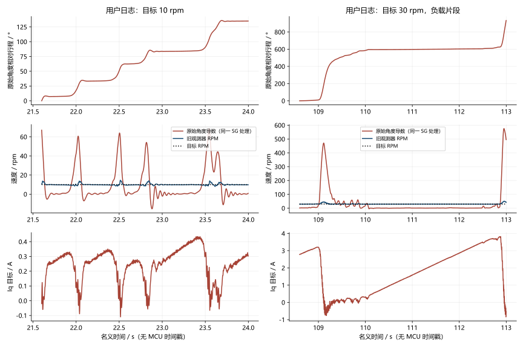
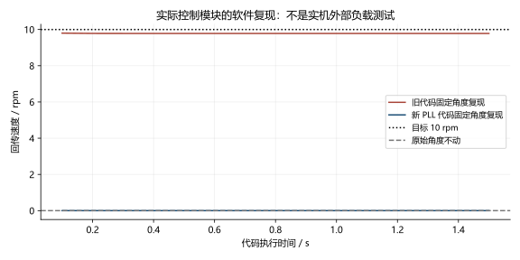
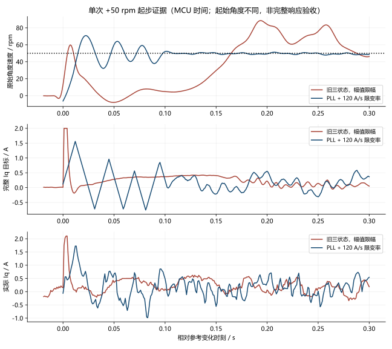

# 低速停转误报修复与原始角度验收（2026-10-03）

**结论：确认并修复旧测速器的停转误报；低速运动连续性改善。整体低波动和启停验收尚未通过。**

本轮 10:29 开始，使用同一圆柱负载、电池供电、COM14 与 ST-Link。各运行对照临时限制 Iq 为 2 A；交付固件恢复原有 8 A 上限，保持全部保护。不能把 2 A 测试当作 8 A 全工况验收。

## 1. 用户日志直接证明了什么

原文件 `D:\Downloads\8fdcc3d电机日志.csv` 保持只读，共 103,958 帧。I0～I19 按当前固定 20 通道协议解释。全部故障码为 0。CSV 没有 MCU 时间戳或人工施加载荷标记，以下时间由帧号 / 500 Hz 换算，不能认定准确的手动负载起止时刻。

| 代表窗口 | 目标 | 回传平均速度 | 原始角度净行程换算速度 | 完整 Iq 目标 |
|---|---:|---:|---:|---|
| 行 11489～11613，约 22.978～23.226 s | 10 rpm | 9.876 rpm | 0.216 rpm | 末值约 0.366 A |
| 行 55027～55445，约 110.054～110.890 s | 30 rpm | 29.265 rpm | 0.383 rpm | 0.258 → 1.446 A |

行号为从零开始的数据行，不含表头。第二段原始角度几乎停住，速度回传却接近目标，电流仍不断增加。原始角度有微小运动，不能写成精确零速；但差异远超过正常测速延迟。



完整 SHA256：`94f02aa5dd6034c3785014f56e1290d8da1707d035d599377c9106d653228d3c`。窗口筛选和文件信息见 [user_log_analysis.json](user_log_analysis.json)。这些片段用于定位异常，不能替代全部稳态记录的验收统计。

## 2. 为什么旧观测器会报出接近目标的速度

旧代码是固定增益的角度 / 速度 / 负载三状态观测器，实际 Iq 驱动速度预测，编码器残差校正三个状态。它没有实现论文的自适应 Kalman 协方差更新。

固定真实角度时，速度 PI 仍累加电流；观测器把不断增加的电流与缓慢变化的负载估计配合起来，可以维持非零的内部速度。固定角度、理想电流跟踪的真实 C 控制模块复现得到 **目标 10 rpm、回传约 9.782 rpm**，而原始角度始终不动。这是软件复现，不是人工堵转实机测试。

旧参数满足近似准稳态关系：`c = -6·Lload/Lθ = 0.04446025 A/(s·rpm)`，`v估计 ≈ Ki·r/(Ki+c)`；Ki=2 时，r=10 得到 9.7825 rpm。用户 30 rpm 窗口的 Iq 增长斜率约 1.310 A/s，与 `c·29.265 ≈ 1.301 A/s` 接近。它解释了异常机制；不证明机械负载模型在所有工况都成立。

因此，之前仅基于这个观测器输出计算的“低速度波动”不能作为运动平稳的证据；高速电流统计仍是真实电流目标统计，但不能单独证明跟随能力合格。



## 3. 修改前后算法

```text
旧：实际 Iq ─→ 三状态角度/速度/负载预测 ─→ 速度估计
                 ↑ 编码器角度残差             ↓
目标 ─────────────────────────────→ 二自由度速度 PI
原始绝对角度 ─→ 512 点前馈 ───────→ 相加 → 幅值限幅 → 电流环
                                            └→ 反算抗饱和

新：受保护的编码器角度增量 ─→ 两状态 PLL ─→ 速度反馈
目标 ─────────────────────────────→ 二自由度速度 PI
原始绝对角度 ─→ 同一 512 点前馈 ───→ 相加 → 幅值限幅
                                               ↓
                                      完整目标限变率 → 电流环
                                               └→ 统一反算抗饱和
```

PLL 使用相对相位误差，避免多圈或大绝对角度下的浮点舍入；不使用目标或 Iq 预测速度。结构参考 [ODrive 编码器 PLL](https://github.com/odriverobotics/ODrive/blob/3a2e4dd1bfbda9e4c534d5c7d8428a99c361e783/Firmware/MotorControl/encoder.cpp) 与 [moteus](https://github.com/mjbots/moteus/blob/8f747f4ac448d117c1390b77ca2d80c27e751a56/fw/motor_position.h)。本机实验值为自然频率 2000 rad/s、临界阻尼；自然频率不是直接等同于测得闭环带宽。

完整 Iq 目标限制为每次实际外环时间差乘以 **120 A/s**，加入前馈后统一约束，抗饱和追踪这个最终目标。120 A/s 是本机实验值，不是文献规定值。停机和故障仍直接关闭功率，不经过斜坡。

使用最终输出进行积分跟踪参考 [MathWorks 抗饱和说明](https://www.mathworks.com/help/simulink/slref/anti-windup-control-using-a-pid-controller.html)。[ODrive 控制文档](https://docs.odriverobotics.com/v/latest/manual/control.html)说明参考轨迹和斜坡对运动冲击的处理，但不能证明本机响应已经达标。

电流环 20 kHz、外环约 1 kHz、20 通道 / 500 Hz / 84 字节、速度 Kp=0.1 / Ki=2、β=0.8、512 点表和 50～200 rpm 退出区间保留。没有重新标定或进行补偿开关对照，不能把改善单独归功于抗齿槽表，也不能称该表已优化完成。

## 4. 同台架低速结果：用原始角度判断

下表为 **仅替换 PLL、尚未加入限变率** 的完整稳态记录。进入后排除 2 s；按同一方法对通道 8 解缠，采用 25 点三阶 Savitzky–Golay 导数（500 Hz），求速度标准差。这个离线导数与控制反馈独立，但仍受编码器误差和采样限制影响。Iq 使用最终完整目标，未额外滤波或减去前馈。

| 目标 rpm | 旧原始角度速度 σ / rpm | PLL 原始角度速度 σ / rpm | 旧完整 Iq σ / A | PLL 完整 Iq σ / A |
|---:|---:|---:|---:|---:|
| +1 | 5.7673 | 0.0633 | 0.0724 | 0.1514 |
| −1 | 5.7357 | 0.0786 | 0.0720 | 0.1465 |
| +5 | 12.9412 | 0.1477 | 0.0943 | 0.1468 |
| −5 | 12.0996 | 0.1450 | 0.0804 | 0.1482 |
| +10 | 17.0087 | 0.2009 | 0.1104 | 0.1496 |
| −10 | 16.8045 | 0.2002 | 0.1118 | 0.1475 |
| +50 | 10.9825 | 0.7592 | 0.0627 | 0.1950 |

PLL 的 ±1 rpm 稳态原始行程分别约 +408.05°、−407.84°，覆盖完整一圈，平均速度约 +0.99998 / −0.99946 rpm。旧 +1 rpm 的 100 ms 行程低于目标 10% 的最长连续段为 2.528 s；PLL 的 ±1/5/10 rpm 同一定义下未出现这些连续段。该指标叫“低进展段”，并不等同于外部传感器确认的绝对停转。

**电流波动增加这一点必须保留。** 新反馈让原先被隐藏的走停问题得到纠正，但总 Iq 标准差约 0.15 A。低速前馈和真实周期转矩也会贡献电流变化；尚未做开关对照，不能据此准确拆分来源，更不能把补偿从总电流中扣除宣称低波动通过。


原始统计见 [before.metrics.json](before.metrics.json)、[pll.metrics.json](pll.metrics.json)、[pll_rest.metrics.json](pll_rest.metrics.json)。

## 5. 起步限变率证据与限制

PLL-only 的 −50 rpm 起步曾出现 Iq 目标在数毫秒内负饱和、转正、再负饱和，随后编码器欠压保护。加入完整目标限变率后，完成一次 ±50 rpm 起步 / 归零序列，随后 +100 rpm 起步又触发欠压。

下面仅比较一次 +50 rpm 起步，原生 SRAM 约 1 kHz 采样、MCU 时间对齐。两次起始机械角度不同，不能据此验证响应时间增加不超过 10%。旧样本从已保存的故障 SRAM 提取，提取时没有运行或修改板子。



所绘窗口旧 / 新 Iq 峰值为 2.00 / 1.56 A，原始角度速度峰值约 88.49 / 70.82 rpm；新方案仍有起步振铃和电流换向。不能写成冲击消除。1 kHz 记录与实际 PI 更新不完全同步，单个记录间隔的电流斜率可能超过名义 120 A/s；临时 C 检查按实际更新 dt 验证了约束。

## 6. 欠压故障与停机

| 固件变体 / 工况 | 首个编码器返回（含有效 CRC） | 编码器错误累计 | 结果 |
|---|---|---:|---|
| 旧观测器，+1000→−1000 rpm | `68 09 84 BC`，状态 4 | 108 | 保护停机 |
| PLL-only，−50 rpm 起步 | `14 66 A4 F7`，状态 4 | 41 | 保护停机 |
| PLL + 限变率，+100 rpm 起步 | `2D 34 BC 42`，状态 4 | 122 | 保护停机 |

状态 4 为 MT6835 欠压告警。三次故障现场 ADC、PWM/编码器时序与 UART 错误计数均为 0；工作最大计数 5637 / 5322 / 4918 个 168 MHz tick（约 33.55 / 31.68 / 29.27 μs），包含临时采集开销。

用户两次报告重启后，均先确认停机、编码器数据有效、错误计数稳定再恢复一次。第三次复现后不再清错运行。没有测量编码器芯片 VDD 瞬态，不能判断具体供电或接线根因；ST-Link 的 MCU 电压不能替代这项测量。

## 7. 交付与验收状态

Debug / Release 构建通过；实际控制模块临时 C 检查通过：固定角度拒绝目标 / 电流造成的假速度，正负角度速度跟踪，正负方向电流幅值 / 限变率，立即 stop。临时 SRAM 与注入代码已从正式源码移除。

正式 Release 已烧录并逐字节回读一致，共 **37,936 字节**：

- 固件 SHA256：`ab4079c814ced07c323a0ac21e65afc72206b8366fcf9c99d9d52cddca543b26`。
- Flash 参数 / 校准区 0x080C0000～0x080FFFFF 与本轮开始备份逐字节一致；SHA256：`09cd6506b6dab9c676d5aabb47e16a80afbc4fea465c8e7c0970b5d8593c6f08`。
- 最终 stop 确认：fault=0、power_on=0、速度 / 目标=0；母线 23.316 V；零偏标准差 B/C=3.165 / 3.351 mV，符合现有 4 mV 判据。
- 正式 8 A 固件仅完成停机链路验证，没有在欠压根因未确定时重启带电测试。

| 项目 | 本轮结论 |
|---|---|
| 停转误报机制与代码修复 | 日志、固定角度 C 复现支持；需补实际负载停转复核 |
| 低速运动连续性 | PLL-only 的 ±1/5/10 rpm 对照改善；最终组合待完整圈复测 |
| 高速总 Iq σ≤0.02 A | 未覆盖新 PLL，不能沿用旧观测器成绩 |
| 阶跃 / 反转响应余量 10% | 未完成；部分起步和反转欠压失败 |
| 抗齿槽新标定 / 关开对照 | 未完成，表保持原值 |
| 最终十次复位 / 完整 300 s 波形 / 位置环验收 | 未完成 |
| 声压、机械振动、温升 | 无仪器，未测 |

## 8. 复现与后续工作

原始 CSV / UART / SRAM、每个测试变体 ELF / BIN、命令事件、首故障与停机证据保存在 `E:\405_FOC\405_FOC\build\bench_debug\20261003_102900`。图表使用 NumPy / SciPy / Matplotlib 渲染，SVG / PDF / PNG 同时交付；输入文件哈希见 [provenance.json](provenance.json)。

后续先定位编码器欠压，再对最终组合做完整低速圈、实际负载停转检查和补偿开关对照。联合测速带宽与 PI 的频率响应整定参考 [Ramos Garces 等](https://arxiv.org/html/2202.08648v1)。本轮没有新完整激励数据和相干性，因此不生成冒充实测的 Bode / 稳定裕量图。抗齿槽须在不振荡的基础控制器上标定，参考 [ODrive 官方说明](https://docs.odriverobotics.com/v/latest/guides/anticogging.html)。

本轮截至归档用时约 58.4 分钟，受控运行命令保持时间合计 478.6 秒（7.98 分钟；不包含预充和停机滑行，不等同于精确门极通电时长）。最终烧录及停机证据见 [final_verified.json](final_verified.json)。
